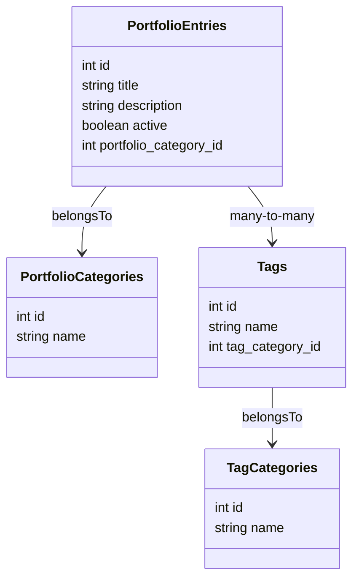
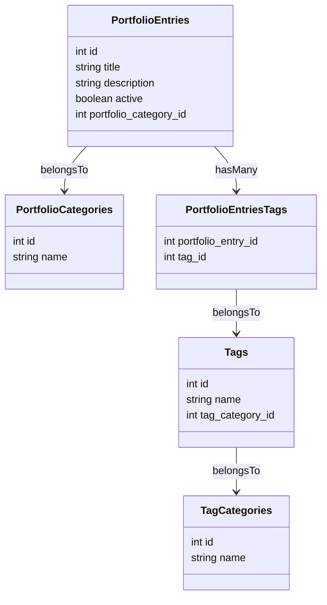

# Simon Moser - Developer Portfolio

Welcome to my portfolio project! This repository showcases my skills and experience as a developer and electrical engineer. As I transition into working with Kotlin, Spring Boot, and Angular, I created this project to demonstrate my ability to quickly learn and apply new technologies while building a professional-grade portfolio.

## 🌐 Live Demo

Explore the live version of this portfolio at [simon-moser.com](https://simon-moser.com).

## 🚀 Features

- **Personal Portfolio**: A modern web application showcasing my past projects and skills.
- **Backend**: Developed with **Kotlin** and **Spring Boot**.
- **Frontend**: Built using **Angular**.
- **Responsive Design**: Ensures compatibility across devices and screen sizes.
- **Scalable Architecture**: Organized project structure for maintainability and scalability.

## 🛠️ Tech Stack

### Backend
- **Language**: Kotlin
- **Framework**: Spring Boot
- **Build Tool**: Gradle

### Frontend
- **Framework**: Angular
- **Language**: TypeScript
- **Build Tool**: Angular CLI

### Other Tools
- **Version Control**: Git
- **Containerization**: Docker Compose

## 🗂️ Directory Structure

```
.
├── LICENSE          # License information
├── README.md        # Project documentation
├── docker-compose.yml # Docker Compose configuration
├── backend/         # Backend code with Spring Boot
├── frontend/        # Frontend code with Angular
```

## 📊 Database Structure

The portfolio application uses a relational database to manage entries, categories, and tags efficiently. Below is the
class diagram representing the database structure:



Here is the **"Database Structure"** section for your README:

---

## 📊 Database Structure

The portfolio application uses a relational database to manage entries, categories, and tags efficiently. Below is the class diagram representing the database structure:



## 🔑 A Note on Credentials

This repository contains test credentials, such as those found in the Spring Boot configuration files or the Docker Compose file. **Please note**: this is an intentional bad practice, used here solely for development and testing purposes in a controlled, containerized environment.

No sensitive or production data is processed in this project, and these credentials are not intended for use in any production setting.

> [!IMPORTANT]
> Always follow secure credential management practices, such as using environment variables or secret management tools, when developing production-grade applications.

## 🚀 Getting Started

### Prerequisites

Ensure you have the following installed:

- **Docker**
- **Docker Compose**

### Running the Application

To build and run the entire application, simply use the following command:

```bash
docker compose up
```

This command will:

- Build the backend and frontend.
- Start the PostgreSQL database, Spring Boot backend, and Angular frontend.

The application will be available at:

- **Frontend**: [http://localhost:4200](http://localhost:4200)
- **Backend API**: [http://localhost:8080](http://localhost:8080)
- **Database**: Accessible on port 5432.

## 💡 What This Portfolio Demonstrates

- My ability to quickly learn and implement new technologies.
- Proficiency in organizing and structuring full-stack applications.
- Skills in modern development practices with Kotlin, Spring Boot, and Angular.
- Practical experience in creating a responsive and professional web application.

## 📄 License

This project is licensed under the terms of the [MIT License](./LICENSE).

